```{r setup, include=FALSE}
options(htmltools.dir.version = FALSE)
```

# Agenda

.pull-left[
  
1. Brief introduction to R

2. Real-world applications

3. Meetups in 2018

4.   Open end

]

.pull-right[


]  

---
# _What topics are you interested in?_
_Please provide as many ideas as possible to help us make future meetups fun and engaging!_

```{r message=FALSE, warning=FALSE, echo = FALSE}
require(RCurl)
require(plyr)

dataCSV <- getURL('https://docs.google.com/spreadsheets/d/e/2PACX-1vSWD6_CABXMzqs5lA6_XjiPhJBpRf8zrgYzZ7AjQA5NJQy_e3_rcMvep1bK3SFAsVWGGpdRyMTsqwa4/pub?gid=532789309&single=true&output=csv')
df <- read.csv(textConnection(dataCSV), stringsAsFactors = FALSE)

topics <- unlist(df$topics)
topics <- unlist(strsplit(topics, ','))
topics <- plyr::count(topics)
topics <- topics[order(topics$freq, decreasing = TRUE),]

knitr::kable(head(topics, 10), format = 'html')

```

---

# _R-Leipzig Member Survey_

.small[
```
require(RCurl)
require(plyr)

dataCSV <- getURL('https://docs.google.com/spreadsheets/d/e/2PACX-1vSWD6_CABXMzqs5lA6_XjiPhJBpRf8zrgYzZ7AjQA5NJQy_e3_rcMvep1bK3SFAsVWGGpdRyMTsqwa4/pub?gid=532789309&single=true&output=csv')
df <- read.csv(textConnection(dataCSV), stringsAsFactors = FALSE)

topics <- unlist(df$topics)
topics <- unlist(strsplit(topics, ','))
topics <- plyr::count(topics)
topics <- topics[order(topics$freq, decreasing = TRUE),]

knitr::kable(head(topics, 10), format = 'html')
```
]
---
# _How would you rate your experience level?_

.center[
```{r message=FALSE, warning=FALSE, echo = FALSE}
require(RCurl)
require(plyr)

dataCSV <- getURL('https://docs.google.com/spreadsheets/d/e/2PACX-1vSWD6_CABXMzqs5lA6_XjiPhJBpRf8zrgYzZ7AjQA5NJQy_e3_rcMvep1bK3SFAsVWGGpdRyMTsqwa4/pub?gid=532789309&single=true&output=csv')
df <- read.csv(textConnection(dataCSV), stringsAsFactors = FALSE)

experience_level <- unlist(df$experience_level)


hist(experience_level)

```
]

---
# _Do you have a background in one or more of the following sciences?_

```{r message=FALSE, warning=FALSE, echo = FALSE, cache = FALSE}
require(RCurl)
require(plyr)

dataCSV <- getURL('https://docs.google.com/spreadsheets/d/e/2PACX-1vSWD6_CABXMzqs5lA6_XjiPhJBpRf8zrgYzZ7AjQA5NJQy_e3_rcMvep1bK3SFAsVWGGpdRyMTsqwa4/pub?gid=532789309&single=true&output=csv')
df <- read.csv(textConnection(dataCSV), stringsAsFactors = FALSE)

background <- unlist(df$background)
background <- unlist(strsplit(background, ','))
background <- plyr::count(background)
background <- background[order(background$freq, decreasing = TRUE),]

knitr::kable(head(background, 10), format = 'html')

```

---
class: inverse, center, middle

# Introduction to R

---

class: center, middle

# Why use R?
A quick comparison to other languages


---
class: center, middle

> "The best thing about `R` is that it was written by statisticians."


--

_while_


> "The worst thing about `R` is that it was written by statisticians."

---
class: middle

.pull-left[


- better, user friendly data analysis

- easy to use complex formula and advanced models

- steep learning curve (not hard for experienced programmers)

- good for standalone analysis

- the closer you are to statistics and research the more you might prefer R
]

.pull-right[


- productivity and code reusability

- more flexible to program new stuff

- easy to learn for beginners

- good for analysis integrated into larger frameworks

- the closer you are to engineering, the more you might prefer python
]

---
class: middle

.pull-left[

- **Visualisation**

- Lingua franca of statistics

- Traditional computational statistics (machine learning)

- **Data exploration**

- R Studio

- Shiny

]

.pull-right[
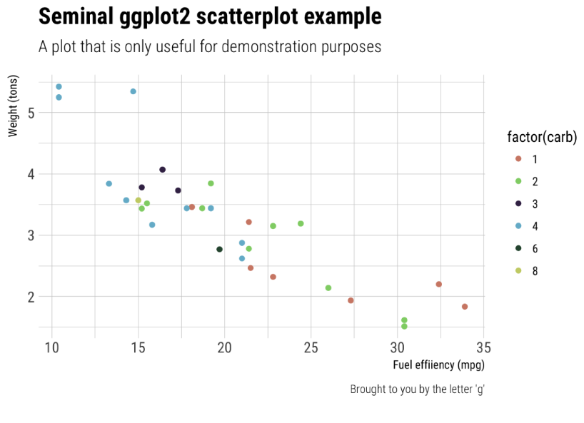
.small[https://hrbrmstr.github.io/hrbrthemes/]
]

---
class: center, middle


.small[https://timogrossenbacher.ch/2016/12/beautiful-thematic-maps-with-ggplot2-only/]

---
class: middle

.pull-left[


- slow (and sometimes ugly) code

- steep learning curve
]

.pull-right[


- producing nice visualisations can be a pain

- immature functionality for data analysis
]

---
class: center, middle


Open Source

Advanced Tools

Online Communities

Jobs

---

class: middle

.pull-left[


- _interesting_ language design

- good for statistics heavy projects

- large ecosystem of packages

- mature system

- native code rather slow

]

.pull-right[


- clean language design

- number crunching

- developing ecosystem

- < v1.0

- native code fast
]

---
class: center, middle

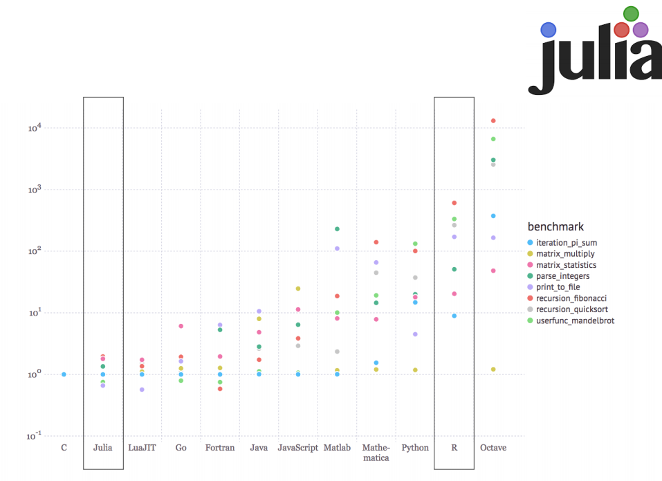

---
class: center, middle
# From my perspective

 for reliable statistical analysis (smaller scale)

 for larger data analysis/Deep Learning projects

 for new, experimental ideas (and fun)

---

class: center, middle

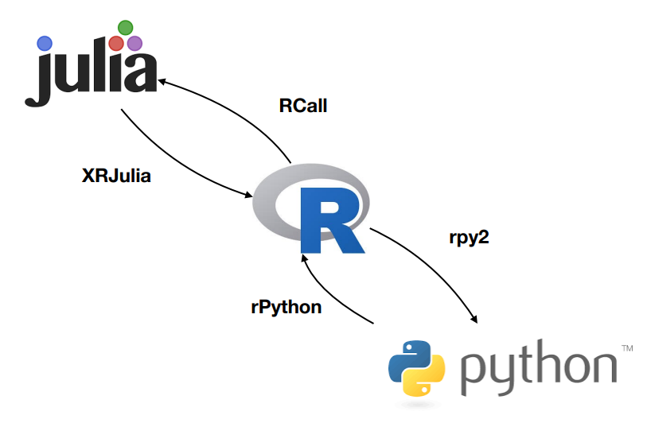

---

class: center, middle

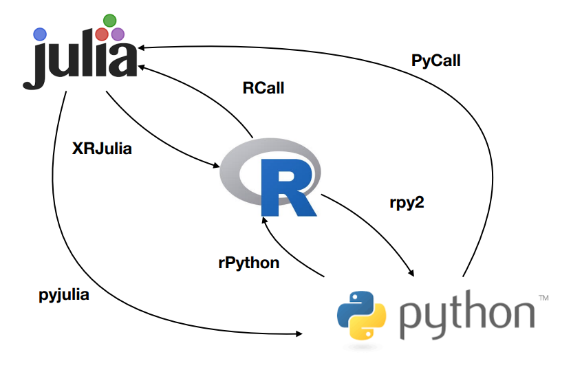

---

class: center, middle

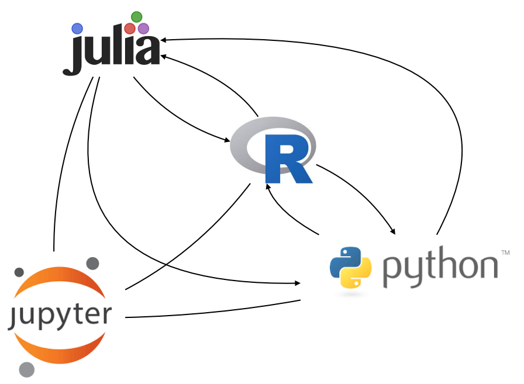

---
class: inverse, center, middle

# Real-world applications

---
class: center, middle

.left[


Case 1: [magnolia psychometrics](https://www.magnolia-psychometrics.com/) predictive personality testing
]

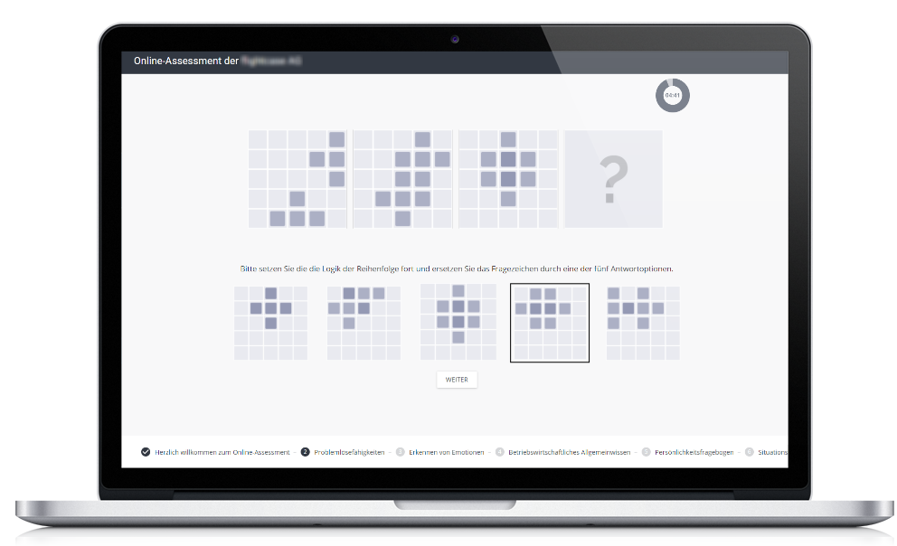


---

class: center, middle

.left[


Case 1: [magnolia psychometrics](https://www.magnolia-psychometrics.com/) predictive personality testing
]

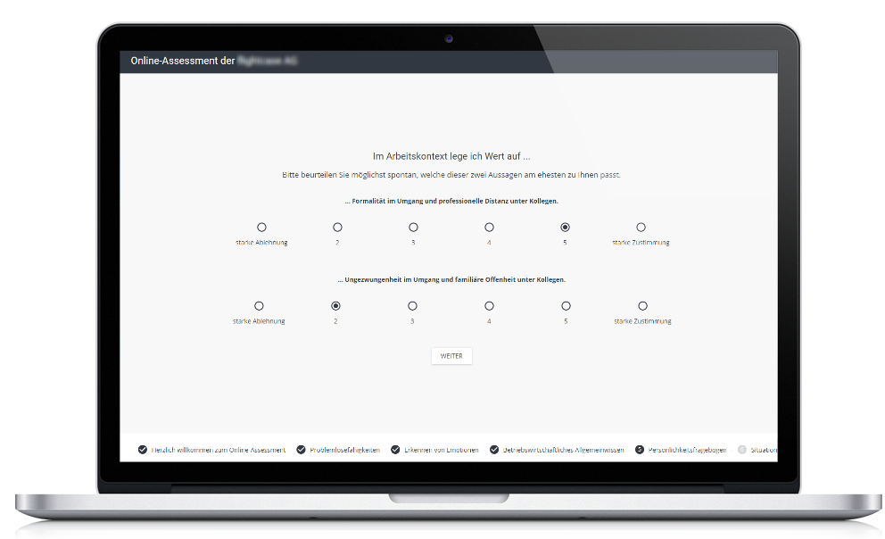

---

class: center, middle

.left[


Case 1: [magnolia psychometrics](https://www.magnolia-psychometrics.com/) predictive personality testing
]

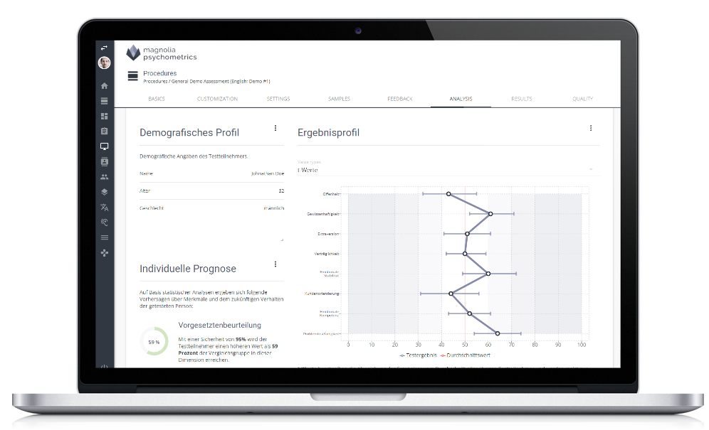

---

class: center, middle

.left[


Case 1: [magnolia psychometrics](https://www.magnolia-psychometrics.com/) predictive personality testing
]

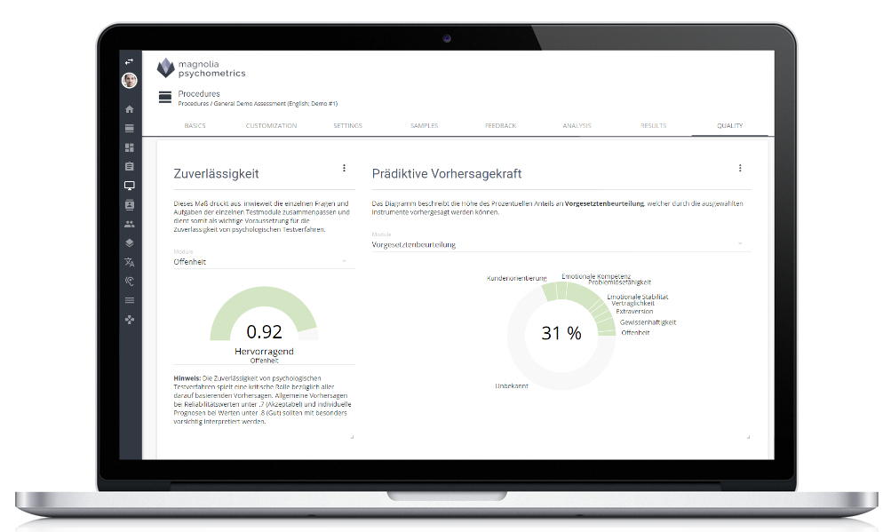

---

Case 2: [Using R to prevent food poisoning in Chicago](http://blog.revolutionanalytics.com/2016/12/food-inspection-forecasting.html)

.center[

]

Foodborne illness in the U.S.

- **48 million** people get sick
- **128,000** get hospitalized
- **3,000** die

according to the center for disease control and prevention. The situation in the City of **Chicago** was particularly bad. Something had to be done... 

---

Case 2: [Using R to prevent food poisoning in Chicago](http://blog.revolutionanalytics.com/2016/12/food-inspection-forecasting.html)

To predict the probability of food establishmentsto have critical violations, data scientists looked at...

```yaml
Business Licenses
Food Inspections 
Crime
Garbage Cart Complaints
Sanitation Complaints
Weather
Sanitarian Information
```

---

Case 2: [Using R to prevent food poisoning in Chicago](http://blog.revolutionanalytics.com/2016/12/food-inspection-forecasting.html)

...and increased the rate of detecting violations by **25%**

.center[
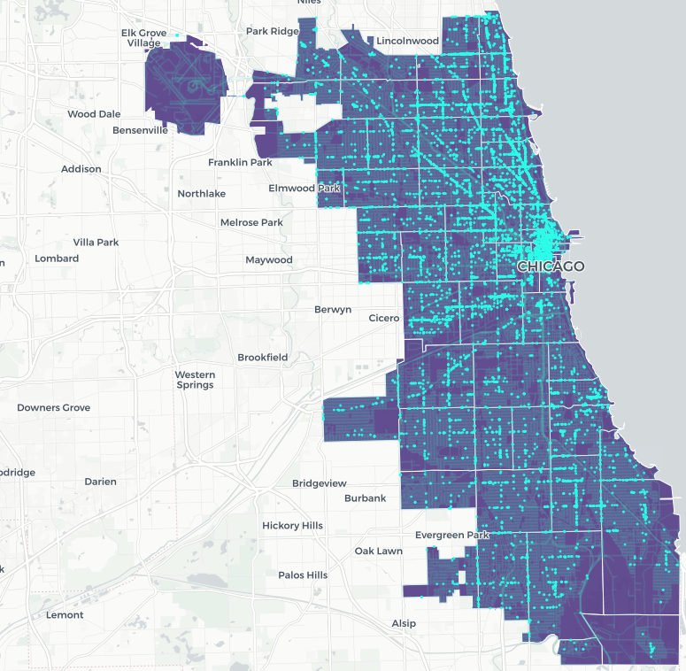
]


---

Case 2: [Using R to prevent food poisoning in Chicago](http://blog.revolutionanalytics.com/2016/12/food-inspection-forecasting.html)

For data processing the code uses extensivelythe `data.table` package.


```yaml
## Calcualte time since last inspection.
## If the time is NA, this means it's the first inspection; add an inicator 
## variable to indicate that it's the first inspection.
dat_model[i = TRUE , 
          j = timeSinceLast := as.numeric(
              Inspection_Date - shift(Inspection_Date, -1, NA)) / 365, 
          by = License]
dat_model[ , firstRecord := 0]
dat_model[is.na(timeSinceLast), firstRecord := 1]
dat_model[is.na(timeSinceLast), timeSinceLast := 2]
dat_model[ , timeSinceLast := pmin(timeSinceLast, 2)]
```

All code available on [GitHub](https://github.com/Chicago/food-inspections-evaluation)

---

class: inverse, center, middle

# R-Meetups in 2018

---

# What to expect from R-Meetups

Goals
  - Networking
  - Interdisciplinary Insights
  - Practical Learning
  
--

Outline

|                    |                                                |            |
|--------------------|------------------------------------------------|------------|
| Topic introduction | _see scheduled topics_                         | (~15 mins) |
| Code practice      | _attempt to solve the problem in small groups_ | (~60 mins) |
| Stand-ups          | _tell us about your projects and/or probelms_  | -          |
| Open end           | _code, network or drink beer_                  | -          |

---

# Dataset

[Speed Dating Experiment](https://www.kaggle.com/annavictoria/speed-dating-experiment): _What attributes influence the selection of a romantic partner?_

Data from experimental speed dating events from 2002-2004, availible on [kaggle](https://www.kaggle.com) (_N_ ~ 8,000 observations)

--

Data Exploration Ideas
- What are the least desirable attributes in a male partner? Does this differ for female partners?
- Can people accurately predict their own perceived value in the dating market?
- ...

---
class: center, middle

_"The Ugly Truth of People Decisions in Speed Dating"_

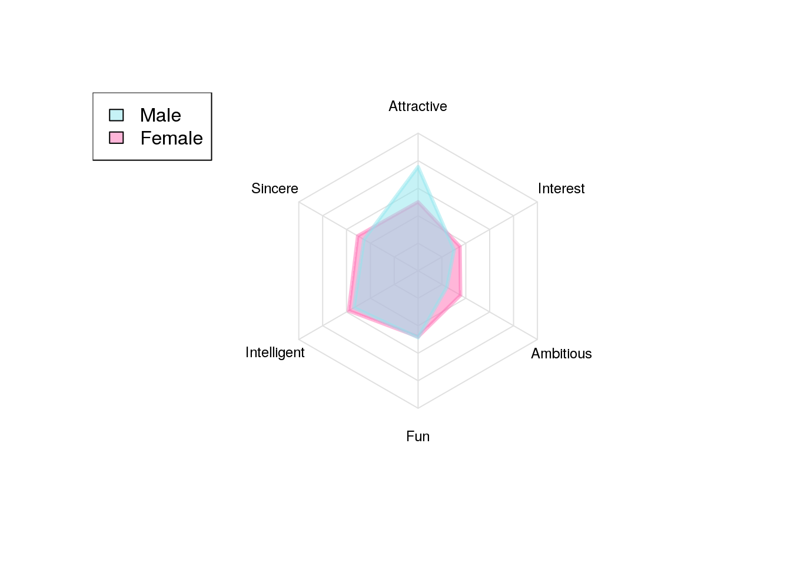

.small[
[Insighty by James Hwang, Lucas Cadalzo](https://www.kaggle.com/jph84562/the-ugly-truth-of-people-decisions-in-speed-dating)
]

---
# Save the date

| topic                     | date              | moderator          |
|---------------------------|-------------------|--------------------|
| Data Visualization        | 16th April, 19:00 | by Mandy Vogel     |
| Exploratory Data Analysis | 21th May, 19:00   | by Björn Hommel    |
| Machiene Learning         | 18th June, 19:00  | by Nico Scherf     |
| RMarkdown                 | 16th July, 19:00  | by Valentin Stefan |
| _yet to be decided_       | -                 | by _you?_          |
| _yet to be decided_       | -                 | by _you?_          |
| _yet to be decided_       | -                 | by _you?_          |

- Volunteers?

---
# Resources

- Updates about meetups on [meetup.com](https://www.meetup.com/Leipzig-R-statistical-computing/)

- r-leipzig's projects & presentations on [GitHub](https://github.com/r-leipzig/r-leipzig/)

- r-leipzig on [slack](https://r-leipzig.slack.com/) for r-related exchange

- Speed-Dating dataset on [kaggle](https://www.kaggle.com/annavictoria/speed-dating-experiment)

---

class: center, middle

# Thanks!


